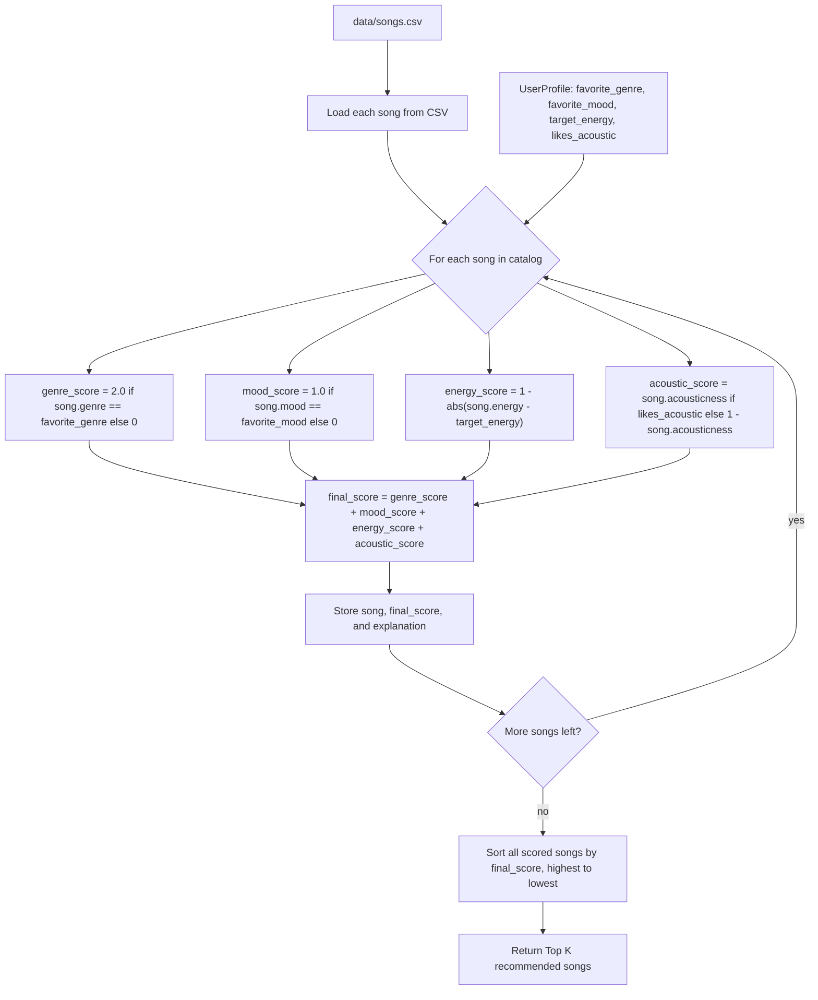

# AI Interactions Log

> **Stretch features only.** Only fill in the sections that apply to stretch features you attempted. If you did not attempt a stretch feature, leave its section blank or delete it. This file is not required for the core project.

---

## Step 1: Algorithm Recipe

```
## Algorithm Recipe: Music Recommender Scoring Rules

### Features Used
Song: genre, mood, energy, acousticness
User: favorite_genre, favorite_mood, target_energy, likes_acoustic

### Scoring Rules
1. Genre Match: if song.genre == user.favorite_genre: +2 points
2. Mood Match: if song.mood == user.favorite_mood: +2 points
3. Energy Closeness: energy_score = 1 - abs(song.energy - user.target_energy)
4. Acoustic Preference:
   - if likes_acoustic == True: acoustic_score = song.acousticness
   - if likes_acoustic == False: acoustic_score = 1 - song.acousticness

### Final Formula
final_score = genre_score + mood_score + energy_score + acoustic_score
(genre_score, mood_score ∈ {0, 2}; energy_score, acoustic_score ∈ [0, 1])

### Ranking Rule
Score every song, sort descending by final_score, return the top k.

### Explanation Template
"Recommended because it matches your favorite genre and mood, and its
energy level is close to your target energy."
```

---

## Phase 2 Step 1: Dataset Expansion

I added 8 new fictional songs (IDs 11–18) to `data/songs.csv`, introducing genres not previously represented: hip hop, folk, electronic, classical, r&b, metal, reggae, and country. This improves diversity because the original dataset leaned heavily toward `lofi` and `pop` genres and `chill`/`happy`/`intense` moods — the new songs add moods like confident, nostalgic, euphoric, melancholy, romantic, angry, uplifting, and wistful, and widen the numeric range of energy and acousticness values so the scoring rules have more contrast to work with.

---

## Phase 2 Step 2: User Profile Design

For my first test profile, I chose favorite_genre="lofi", favorite_mood="chill", target_energy=0.35, likes_acoustic=True — a "quiet focus listener" persona. This profile exercises all four scoring rules and produces a clear separation between matching songs, such as low-energy acoustic lofi/chill tracks, and mismatched songs, such as high-energy low-acousticness rock or metal tracks. I also plan to test a contrasting high-energy, non-acoustic profile to confirm the scorer behaves correctly across the full range.

---

## Phase 2 Step 3: Scoring Logic Design

The final scoring recipe:

- Genre match: `+2.0` points if `song.genre == user.favorite_genre`, else `0`
- Mood match: `+1.0` point if `song.mood == user.favorite_mood`, else `0`
- Energy closeness: `energy_score = 1 - abs(song.energy - user.target_energy)`, range 0–1
- Acoustic preference: `song.acousticness` if `likes_acoustic` is True, else `1 - song.acousticness`, range 0–1

Final formula:

`final_score = genre_score + mood_score + energy_score + acoustic_score`

Maximum possible score is `5.0` (2.0 + 1.0 + 1.0 + 1.0).

Scoring logic and ranking logic are kept separate: scoring logic calculates a `final_score` for one song against the user profile at a time, while ranking logic sorts all of the scored songs from highest to lowest score and returns the top results as recommendations.

---

## Phase 2 Step 4: Recommendation Flow Visualization

### Mermaid Flowchart



### Text-Based Diagram

```
UserProfile ─┐
             ├─> For each song in songs.csv:
data/songs.csv ─┘        │
                          ├─ genre_score    = 2.0 if genre matches else 0
                          ├─ mood_score     = 1.0 if mood matches else 0
                          ├─ energy_score   = 1 - abs(song.energy - target_energy)
                          ├─ acoustic_score = acousticness (or 1 - acousticness)
                          │
                          └─ final_score = sum of the above
                                  │
                                  v
                          store (song, final_score, explanation)
                                  │
                    (repeat for every song in catalog)
                                  │
                                  v
                sort all (song, score, explanation) by final_score, desc
                                  │
                                  v
                          return Top K recommendations
```

### How One Song Moves Through the Pipeline

A single song is read from `data/songs.csv` and paired with the current `UserProfile`. It's scored in isolation: genre and mood are checked for an exact match (contributing 2.0 and 1.0 points respectively), energy contributes a 0–1 value based on how close the song's energy is to `target_energy`, and acousticness contributes a 0–1 value based on the `likes_acoustic` preference. These four values are added into one `final_score`, and the song is stored alongside its score and a short explanation. Once every song in the catalog has gone through this same process, the full list is sorted by `final_score` from highest to lowest, and only the Top K songs are returned as recommendations.

---

## Optional Challenge 4: Visual Summary Table

Replaced the bulleted CLI output in `src/main.py` with a lightweight ASCII table (Rank, Song Title, Artist, Score, Reasons), built using only Python's string formatting — no new dependency. Column widths are computed dynamically from the data, and the Reasons column joins the individual reasons with semicolons instead of wrapping across multiple lines, keeping each recommendation on one row. Scoring logic in `recommender.py` was not touched; this was a pure CLI presentation change, and the recommender is still fully CLI-first (`python -m src.main`).

---

## Agentic Workflow (SF8)

> Document your experience using an AI agent (e.g., Cursor Agent, Claude, Copilot) to make multi-step changes autonomously.

**What task did you give the agent?**

<!-- Describe the goal you asked the agent to accomplish -->

**Prompts used:**

<!-- Paste the key prompts you gave the agent -->

**What did the agent generate or change?**

<!-- List the files edited, code generated, or commands run -->

**What did you verify or fix manually?**

<!-- Describe anything the agent got wrong or that required human review -->

---

## Design Pattern (SF10)

> Document how AI helped you choose or implement a design pattern.

**Which design pattern did you use?**

<!-- e.g., Strategy, Factory, Observer, etc. -->

**How did AI help you brainstorm or implement it?**

<!-- Describe the conversation or suggestions that led to your decision -->

**How does the pattern appear in your final code?**

<!-- Point to the relevant class or method -->
