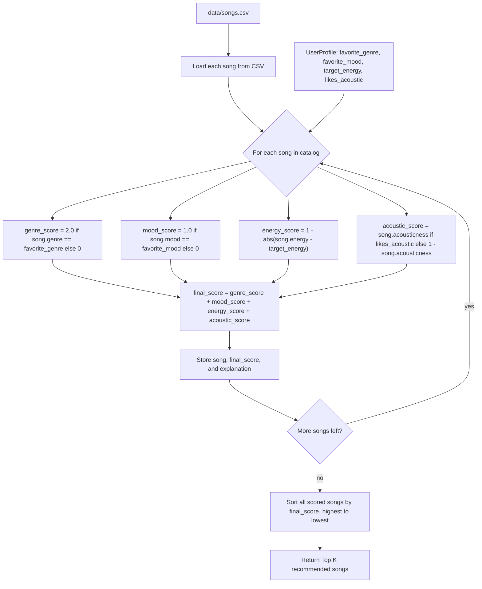

# AI Interactions Log

> **Stretch features only.** Only fill in the sections that apply to stretch features you attempted. If you did not attempt a stretch feature, leave its section blank or delete it. This file is not required for the core project.

---

## Step 1: Algorithm Recipe

```
## Algorithm Recipe: Music Recommender Scoring Rules

### Features Used
Song: genre, mood, energy, acousticness
User: favorite_genre, favorite_mood, target_energy, likes_acoustic

### Scoring Rules
1. Genre Match: if song.genre == user.favorite_genre: +2 points
2. Mood Match: if song.mood == user.favorite_mood: +2 points
3. Energy Closeness: energy_score = 1 - abs(song.energy - user.target_energy)
4. Acoustic Preference:
   - if likes_acoustic == True: acoustic_score = song.acousticness
   - if likes_acoustic == False: acoustic_score = 1 - song.acousticness

### Final Formula
final_score = genre_score + mood_score + energy_score + acoustic_score
(genre_score, mood_score ∈ {0, 2}; energy_score, acoustic_score ∈ [0, 1])

### Ranking Rule
Score every song, sort descending by final_score, return the top k.

### Explanation Template
"Recommended because it matches your favorite genre and mood, and its
energy level is close to your target energy."
```

---

## Phase 2 Step 1: Dataset Expansion

I added 8 new fictional songs (IDs 11–18) to `data/songs.csv`, introducing genres not previously represented: hip hop, folk, electronic, classical, r&b, metal, reggae, and country. This improves diversity because the original dataset leaned heavily toward `lofi` and `pop` genres and `chill`/`happy`/`intense` moods — the new songs add moods like confident, nostalgic, euphoric, melancholy, romantic, angry, uplifting, and wistful, and widen the numeric range of energy and acousticness values so the scoring rules have more contrast to work with.

---

## Phase 2 Step 2: User Profile Design

For my first test profile, I chose favorite_genre="lofi", favorite_mood="chill", target_energy=0.35, likes_acoustic=True — a "quiet focus listener" persona. This profile exercises all four scoring rules and produces a clear separation between matching songs, such as low-energy acoustic lofi/chill tracks, and mismatched songs, such as high-energy low-acousticness rock or metal tracks. I also plan to test a contrasting high-energy, non-acoustic profile to confirm the scorer behaves correctly across the full range.

---

## Phase 2 Step 3: Scoring Logic Design

The final scoring recipe:

- Genre match: `+2.0` points if `song.genre == user.favorite_genre`, else `0`
- Mood match: `+1.0` point if `song.mood == user.favorite_mood`, else `0`
- Energy closeness: `energy_score = 1 - abs(song.energy - user.target_energy)`, range 0–1
- Acoustic preference: `song.acousticness` if `likes_acoustic` is True, else `1 - song.acousticness`, range 0–1

Final formula:

`final_score = genre_score + mood_score + energy_score + acoustic_score`

Maximum possible score is `5.0` (2.0 + 1.0 + 1.0 + 1.0).

Scoring logic and ranking logic are kept separate: scoring logic calculates a `final_score` for one song against the user profile at a time, while ranking logic sorts all of the scored songs from highest to lowest score and returns the top results as recommendations.

---

## Phase 2 Step 4: Recommendation Flow Visualization

### Mermaid Flowchart



### Text-Based Diagram

```
UserProfile ─┐
             ├─> For each song in songs.csv:
data/songs.csv ─┘        │
                          ├─ genre_score    = 2.0 if genre matches else 0
                          ├─ mood_score     = 1.0 if mood matches else 0
                          ├─ energy_score   = 1 - abs(song.energy - target_energy)
                          ├─ acoustic_score = acousticness (or 1 - acousticness)
                          │
                          └─ final_score = sum of the above
                                  │
                                  v
                          store (song, final_score, explanation)
                                  │
                    (repeat for every song in catalog)
                                  │
                                  v
                sort all (song, score, explanation) by final_score, desc
                                  │
                                  v
                          return Top K recommendations
```

### How One Song Moves Through the Pipeline

A single song is read from `data/songs.csv` and paired with the current `UserProfile`. It's scored in isolation: genre and mood are checked for an exact match (contributing 2.0 and 1.0 points respectively), energy contributes a 0–1 value based on how close the song's energy is to `target_energy`, and acousticness contributes a 0–1 value based on the `likes_acoustic` preference. These four values are added into one `final_score`, and the song is stored alongside its score and a short explanation. Once every song in the catalog has gone through this same process, the full list is sorted by `final_score` from highest to lowest, and only the Top K songs are returned as recommendations.

---

## Optional Challenge 4: Visual Summary Table

Replaced the bulleted CLI output in `src/main.py` with a lightweight ASCII table (Rank, Song Title, Artist, Score, Reasons), built using only Python's string formatting — no new dependency. Column widths are computed dynamically from the data, and the Reasons column joins the individual reasons with semicolons instead of wrapping across multiple lines, keeping each recommendation on one row. Scoring logic in `recommender.py` was not touched; this was a pure CLI presentation change, and the recommender is still fully CLI-first (`python -m src.main`).

---

## Optional Challenge 1: Advanced Song Features

**Prompt/workflow:** Asked Claude to add 5 new song attributes (`popularity`, `release_decade`, `language`, `is_explicit`, `instrumentalness`) to `data/songs.csv`, wire up type conversion for them in `load_songs`, and add scoring for only two of them (`popularity` and `instrumentalness`) so the formula stayed simple — `language`, `release_decade`, and `is_explicit` should load correctly but stay unused in scoring for now.

**What AI changed:**
- `data/songs.csv`: added the 5 new columns and filled in plausible values for all 18 songs (popularity 0–100, release_decade one of 1980/1990/2000/2010/2020, language one of English/Spanish/Korean/Hindi/Instrumental, is_explicit True/False, instrumentalness 0.0–1.0).
- `src/recommender.py` → `load_songs`: added conversions for `popularity` (int), `release_decade` (int), `instrumentalness` (float), and `is_explicit` (bool, converted from the `"True"`/`"False"` string rather than relying on Python's truthy string check).
- `src/recommender.py` → `score_song`: added `popularity_score = song["popularity"] / 100` (max +1.0) and `instrumental_score = song["instrumentalness"] * 0.5` (max +0.5) to `final_score`, with matching reason strings (`"popularity bonus (+0.82)"`, `"instrumentalness bonus (+0.30)"`). The original genre/mood/energy/acoustic scoring is untouched. New max possible score is 6.5 (5.0 original + 1.0 + 0.5).

**What I manually verified:** confirmed `is_explicit` used an explicit string comparison (`.strip().lower() == "true"`) rather than `bool(row["is_explicit"])`, since a raw `bool("False")` would incorrectly evaluate to `True` in Python. Also spot-checked that `language`, `release_decade`, and `is_explicit` load correctly onto each song dict but never appear in `score_song`'s math, per the requirement to keep them unused for now.

**Test results:** `python -m pytest` passed (2/2), and `python -m src.main` printed `Loaded 18 songs from data/songs.csv` and ran cleanly across all profiles, with `popularity bonus` and `instrumentalness bonus` now showing in each recommendation's reasons.

---

## Optional Challenge 2: Multiple Scoring Modes

**Chosen design:** A simple Strategy-style approach without a full class hierarchy — `get_scoring_weights(mode)` is a small helper that returns a dict of multipliers (`genre`, `mood`, `energy`, `acoustic`) for a given mode name (`"balanced"`, `"genre_first"`, `"mood_first"`, `"energy_focused"`), and `score_song` just looks up the weights and multiplies them into the same formula it already had. This keeps the "strategy" swappable through a plain string + dict lookup instead of introducing separate strategy classes, which felt like the right amount of complexity for a beginner project. `recommend_songs` gained an optional `mode="balanced"` parameter that it forwards straight to `score_song`, so nothing about the calling code needs to branch on mode itself.

**How AI helped brainstorm it:** Asked Claude how to add named scoring "modes" without duplicating the whole scoring function four times. It suggested keeping one formula and parameterizing it with a weights dict per mode (Strategy pattern in its simplest form — swap the data, not the code path), rather than writing a separate `score_song_genre_first()`, `score_song_mood_first()`, etc. It also pointed out that `"balanced"` needed to reproduce the exact original point values (genre 2.0, mood 1.0, energy ×1, acoustic ×1) so nothing already documented in `model_card.md` would silently change.

**What I manually verified:** Ran `python -m src.main` and confirmed the `balanced` mode's scores for the High-Energy Pop profile still exactly match the scores already written down in `model_card.md` (Sunrise City 5.58, Gym Hero 4.58, etc.) — proving the refactor didn't change default behavior. Then compared `balanced` vs `energy_focused` on the same profile and confirmed the ranking actually shifts (`Storm Runner` moves into the top 5, displacing `Concrete Dreams`), so the weight multiplier is genuinely affecting results and not just cosmetic. Also confirmed `python -m pytest` still passes (2/2), since `score_song(user_prefs, song)` and `recommend_songs(user_prefs, songs, k=5)` both still work with no `mode` argument at all, defaulting to `"balanced"`.

---

## Optional Challenge 3: Diversity and Fairness Logic

**Prompt/workflow:** Asked Claude to add a simple diversity penalty that reduces filter bubbles by penalizing a song if its artist or genre already appears among the already-selected top recommendations. The base scoring in `score_song` had to stay untouched — the penalty is applied only while assembling the final list — and the mode system (`balanced`, `genre_first`, `mood_first`, `energy_focused`) plus the advanced features (`popularity` bonus, `instrumentalness` bonus) all had to keep working.

**What diversity penalty was added:** The change lives entirely in `recommend_songs` in `src/recommender.py`. The flow is:
1. Calculate base scores for every song with `score_song` (unchanged).
2. Sort all songs by base score, highest first.
3. Build the top-k list one song at a time, tracking the genres and artists already picked in two `set`s.
4. When considering a song:
   - if its genre is already in the selected set → subtract `0.25`
   - if its artist is already in the selected set → subtract `0.50`
5. Matching reasons are appended when a penalty applies: `diversity penalty: repeated genre (-0.25)` and `diversity penalty: repeated artist (-0.50)`.
6. The adjusted (post-penalty) score is what goes into the returned recommendation list.

The penalty is greedy: songs are considered in base-score order and each penalty is measured against the songs already chosen, so the very first (highest-scoring) song is never penalized. Since an artist repeat almost always also means a genre repeat, a repeated artist can stack both penalties (`-0.75` total), which correctly punishes the least diverse picks the hardest.

**Why this helps reduce filter bubbles:** Without a penalty, a user whose favorite artist or genre dominates the catalog can get a top-5 that's all the same artist or all one genre — a classic filter bubble that never exposes them to anything new. By docking repeats, the list still leads with the strongest match but nudges later slots toward different artists and genres, so recommendations stay relevant while broadening variety.

**What I manually verified:**
- `.venv/bin/python -m pytest` still passes (2/2) — the existing `score_song` / `recommend_songs` signatures and default `balanced` behavior are intact.
- `python -m src.main` runs cleanly and the penalty reasons now appear in the output. For the **Chill Lofi** profile, `Focus Flow` (LoRoom) shows both penalties — `repeated genre (-0.25)` and `repeated artist (-0.50)` — because `Midnight Coding` (also LoRoom, also lofi) was already selected above it.
- Confirmed the base scores are unchanged: rank-1 songs (which are never penalized) still show the same scores as before, e.g. `Sunrise City 5.58` for High-Energy Pop and `Library Rain 5.79` for Chill Lofi, matching `model_card.md`.
- Confirmed the greedy ordering: in **Deep Intense Rock**, `Sunrise City` drops to `2.28` after a `-0.25` genre penalty and now sits just below the unpenalized `Concrete Dreams (2.44)`, showing the penalty genuinely shifts the adjusted scores.

---

## Agentic Workflow (SF8)

> Document your experience using an AI agent (e.g., Cursor Agent, Claude, Copilot) to make multi-step changes autonomously.

**What task did you give the agent?**

<!-- Describe the goal you asked the agent to accomplish -->

**Prompts used:**

<!-- Paste the key prompts you gave the agent -->

**What did the agent generate or change?**

<!-- List the files edited, code generated, or commands run -->

**What did you verify or fix manually?**

<!-- Describe anything the agent got wrong or that required human review -->

---

## Design Pattern (SF10)

> Document how AI helped you choose or implement a design pattern.

**Which design pattern did you use?**

<!-- e.g., Strategy, Factory, Observer, etc. -->

**How did AI help you brainstorm or implement it?**

<!-- Describe the conversation or suggestions that led to your decision -->

**How does the pattern appear in your final code?**

<!-- Point to the relevant class or method -->
